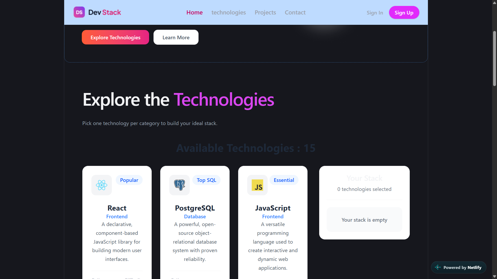

# 🚀 Tech Explorer

Tech Explorer is a modern web application built with React and TypeScript that allows users to explore different technologies and view useful information such as category, description, rating, difficulty level, icons, and popularity badges.

Users can also select technologies and manage their personal stack list with duplicate prevention, add/remove notifications, and loading states.

## 📸 Screenshot



## 🛠️ Technologies Used


## ✨ Main Features

* 🔍 Explore different technologies with detailed information.
* 📚 View technology category, description, rating, difficulty level, icons, and popularity badges.
* ➕ Add technologies to a personal stack list.
* ➖ Remove technologies from the stack list.
* 🚫 Prevent duplicate technologies from being added.
* 🔔 Show toast notifications when technologies are added or removed.
* ⏳ Display a loading state while technology data is being loaded.
* 📭 Show a message when no technology is selected.

## 📦 Dependencies

Main dependencies used in this project include:

* **React** — Building the user interface.
* **React DOM** — Rendering React components.
* **React Router** — Handling application navigation.
* **React Toastify** — Showing toast notifications.
* **Tailwind CSS** — Styling and responsive UI.
* **Vite** — Development server and build tool.
* **TypeScript** — Type-safe JavaScript development.

> The complete dependency list is available in `package.json`.

## 🚀 Getting Started

Follow the steps below to run Tech Explorer locally.

### 1. Clone the repository

```bash
git clone https://github.com/raihankabir1952/assignment-5.git
```

### 2. Navigate to the project directory

```bash
cd assignment-5
```

### 3. Install dependencies

```bash
npm install
```

### 4. Start the development server

```bash
npm run dev
```

The application will be available at the local URL provided by Vite, usually:

```text
http://localhost:5173
```

### 5. Build for production

```bash
npm run build
```

## 🧠 React Questions & Answers

### 1. What is JSX, and why is it used in React?

JSX lets us write HTML-like code inside JavaScript/TypeScript.

It makes React UI code easier to write and understand.

### 2. What is the difference between props and state?

**Props** are data passed from a parent component to a child component.

**State** is data managed inside a component and can change over time.

### 3. What does the `useState` hook do, and where did you use it in this project?

`useState` allows a React component to store and update data.

In this project, it is used to manage technology data and selected technology data.

### 4. What does the `useEffect` hook do, and why did you need it to load the JSON data?

`useEffect` allows us to perform side effects after a component renders.

In this project, it is used to load the JSON data when the application starts.

### 5. Why does every item in a `.map()` list need a unique `key` prop?

The `key` helps React identify individual items in a list.

It allows React to efficiently determine which items have changed, been added, or removed.

### 6. What is conditional rendering? Show one place you used it.

Conditional rendering means displaying UI elements based on a condition.

For example, the project shows a message when no technology is selected:

```jsx
{selectedTech.length === 0 && (
  <p>No technologies selected.</p>
)}
```

### 7. How do you pass data from a parent component to a child component, and how does a child send something back to the parent?

Data can be passed from a parent component to a child component using **props**.

A child component can communicate with its parent by calling a function that was passed to it through props.

## 🔗 Links

### 🌐 Live Demo

[](https://keen-bavarois-b71103.netlify.app/)

### 💻 GitHub Repository

[](https://github.com/raihankabir1952/assignment-5)

## 👨‍💻 Developer

**Raihan Kabir**

* GitHub: [raihankabir1952](https://github.com/raihankabir1952)
* LinkedIn: [Raihan Kabir](https://www.linkedin.com/in/raihan-kabir-4895333a0/)
